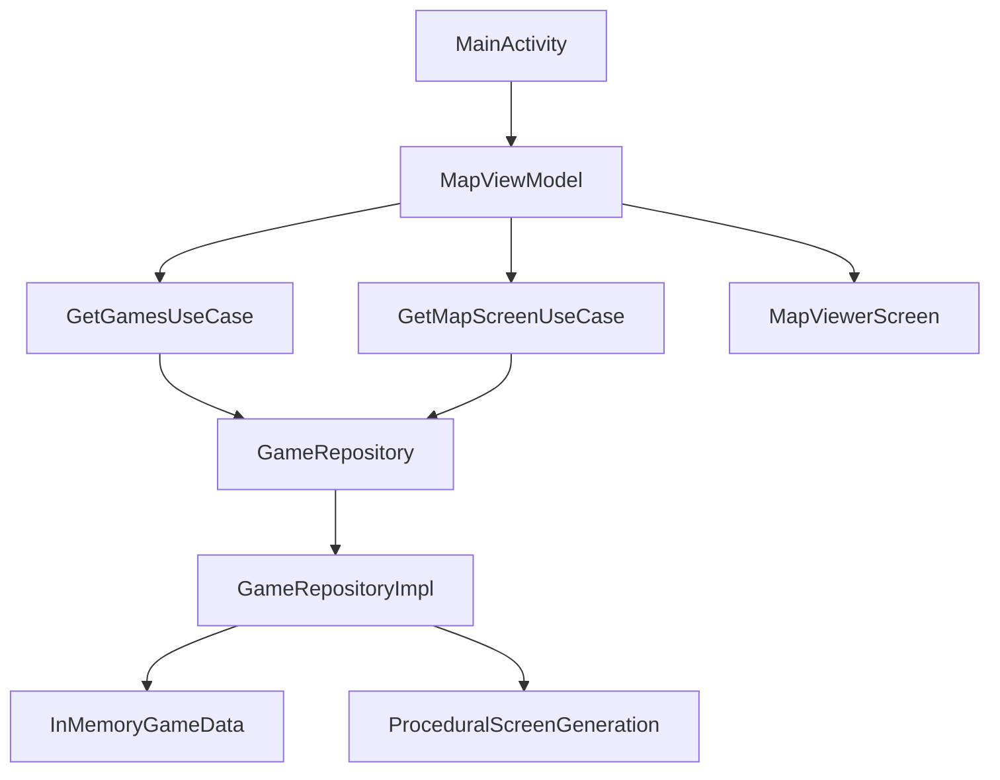

# Quest Adventure

[QuestAdventure.webm](https://github.com/user-attachments/assets/f3cb8d97-0ac5-401f-9c22-4246d6dd4831)

Quest Adventure is an Android game app inspired by Sierra Online's adventure games from the 1980s and early 1990s. It presents a retro exploration experience where players move across quest maps, inspect rooms, and follow terminal-style narrative feedback through a modern Jetpack Compose interface.

The project began as an experimental app generated with Google AI Studio to explore what Gemini 3.5 Flash could produce for Android. The repository has since evolved into a local Kotlin codebase with its own UI, layered architecture, in-memory content model, and developer workflow.

## Overview
- Explore seven King's Quest-inspired quest maps, each with its own theme, story text, dimensions, and movement rules.
- Move north, south, east, and west using swipe gestures or on-screen controls.
- View each location through a custom retro CRT-inspired scene renderer built with Compose canvas APIs.
- Track visited rooms and landmarks on a minimap-style grid overlay.
- Read room descriptions, danger levels, and simulated parser-style system messages in a terminal panel.

## Project Origin
Quest Adventure started as an experimental Android app generated with Google AI Studio as a demonstration of Gemini 3.5 Flash. That origin is part of the project's story, but the current checked-in app should be understood as a standard Android Studio project built with Kotlin, Gradle, and Jetpack Compose.

The repository currently behaves like a local Android game prototype rather than a live AI-powered runtime integration.

## What The App Does
Today, Quest Adventure functions as a retro map exploration app with light adventure-game flavor:

- Loads a list of available quests and starts the player at the selected game's initial coordinate.
- Lets the player switch between multiple quest themes inspired by classic King's Quest entries.
- Retrieves either handcrafted landmark screens or procedurally generated room descriptions for the current coordinate.
- Applies different boundary rules depending on the game. Early quests wrap around map edges, while later quests block movement and show themed warning messages.
- Keeps a history of exploration in a terminal-style log to reinforce the retro text-adventure feel.

The current experience is exploratory, not a full parser adventure. Commands such as `LOOK`, `TAKE`, `TALK`, and `HINT` are represented as flavor interactions in the UI, but there is no inventory, save system, combat loop, or branching quest state yet.

## Architecture
The project uses a lightweight layered architecture with manual dependency wiring.



### Layers
- `presentation`
  - Compose UI, state collection, input handling, retro renderer, minimap, and terminal panel.
  - Main entry points include `MapViewerScreen`, `RetroScreenCanvas`, `GridOverlay`, and `MapViewModel`.
- `domain`
  - Shared models, repository contract, and use cases such as `GetGamesUseCase` and `GetMapScreenUseCase`.
- `data`
  - `GameRepositoryImpl` provides the current data source. It contains the game catalog, landmark overlays, coordinate normalization, and procedural room generation logic.

### Wiring Style
Dependencies are manually constructed in `MainActivity` instead of using a dependency injection framework:

```kotlin
val repository = GameRepositoryImpl()
val getGamesUseCase = GetGamesUseCase(repository)
val getMapScreenUseCase = GetMapScreenUseCase(repository)
val viewModelFactory = MapViewModelFactory(getGamesUseCase, getMapScreenUseCase)
```

### Current Content Model
- Game metadata is defined in code.
- Map content is hybrid:
  - landmark rooms are hardcoded overlays
  - non-landmark rooms are generated procedurally from game and coordinate data
- The data layer is currently in-memory only. There is no active backend, database, or asset pipeline driving quest content at runtime.

## Project Structure
The repository is currently a single-module Android project:

```text
QuestAdventure/
|- app/
|  |- src/main/java/com/example/
|  |  |- data/
|  |  |- domain/
|  |  |- presentation/
|  |  `- MainActivity.kt
|  |- src/test/
|  `- src/androidTest/
|- gradle/
|- build.gradle.kts
|- settings.gradle.kts
`- README.md
```

Note: source files currently live under `app/src/main/java/com/example/...`, while the Kotlin package and Android namespace are `com.huhx0015.questadventure`.

## Tech Stack
- Android app module with Gradle Kotlin DSL
- Kotlin `2.2.10`
- Android Gradle Plugin `9.2.1`
- Gradle wrapper `9.4.1`
- Jetpack Compose with Material 3
- AndroidX Lifecycle and ViewModel Compose
- Kotlin Coroutines and `StateFlow`
- KSP for code generation

## Dependencies
The `app` module currently declares the following libraries and plugins. Some are actively used in the current implementation, while others are present as part of the broader project foundation.

### UI and AndroidX
- `androidx.activity:activity-compose`
- Compose BOM, UI, graphics, tooling, and test APIs
- Compose Material 3
- Compose Material Icons Core and Extended
- Lifecycle runtime, runtime-compose, and viewmodel-compose
- Navigation Compose

### Data and Networking
- Room runtime, KTX, and compiler
- Retrofit
- Moshi and Moshi codegen
- OkHttp and logging interceptor
- Coil Compose

### Async and Language Tooling
- Kotlin Coroutines Core and Android
- KSP

### Build and Project Tooling
- Roborazzi plugin for screenshot testing
- Secrets Gradle Plugin
- Foojay toolchain resolver convention plugin

### Testing
- JUnit 4
- AndroidX Test JUnit, Runner, Core, and Espresso
- Robolectric
- Roborazzi, Roborazzi Compose, and Roborazzi JUnit rule
- Compose UI testing libraries

## Getting Started
### Requirements
- [Android Studio](https://developer.android.com/studio)
- An Android emulator or physical device
- Android SDK packages needed for the project's configured SDK levels

### Open The Project
1. Open Android Studio.
2. Choose **Open** and select this repository.
3. Allow Gradle sync to finish and accept any standard Android Studio project import steps.
4. Run the `app` configuration on an emulator or device.

### Build From The Command Line
```bash
./gradlew assembleDebug
```

On Windows:

```powershell
.\gradlew.bat assembleDebug
```

## Testing
The project includes several layers of test coverage:

- Local unit tests with JUnit
- Robolectric tests for Android-aware JVM execution
- Roborazzi screenshot testing for Compose UI rendering
- Instrumented Android tests for device or emulator execution

Examples in the repository include:
- an instrumentation test that verifies the application package name
- a Robolectric test that checks the app name string resource
- a screenshot test that captures `RetroScreenCanvas` output to `src/test/screenshots/greeting.png`

Run the main test suites with:

```bash
./gradlew test
./gradlew connectedAndroidTest
```

On Windows:

```powershell
.\gradlew.bat test
.\gradlew.bat connectedAndroidTest
```

## Current Limitations
- Quest content is currently defined in source code rather than external content files or a backend service.
- Parser interactions are simulated for atmosphere and do not yet drive a full adventure-game ruleset.
- The app currently centers on map exploration and presentation, not inventory management, puzzle progression, or save/load systems.
- Some declared dependencies are not fully exercised by the current feature set yet.

## Why This Project Exists
QuestAdventure is both a playable prototype and an experiment in AI-assisted Android development. It shows how a generated starting point can be turned into a more intentional app with clearer architecture, stronger theming, and a codebase that can continue to grow.

## Inspiration
QuestAdventure draws inspiration from Sierra Online's classic adventure design language, especially the King's Quest era: world exploration, room-by-room discovery, environmental storytelling, and the feeling of navigating a dangerous fantasy map one screen at a time.
